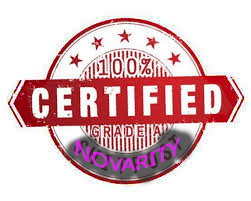

<h1 align="center">
Dynamic Readonly Classes
</h1>

<div align="center">


[](../../raw/main/LICENSE.txt)

</div>

<div align="center">

Misusing anonymous classes in the best way possible.

</div>

# Installation

```bash
composer require novara/dynamic-readonly-classes "*"
```


# Usage

```php
DRCFactory::create(null, [
    'Foo' => 'Bar',
])::Foo // returns 'Bar'
```

This is useful for extending classes:

```php
// SomeClass.php
abstract class SomeClass
{
    public function test(): string
    {
        return static::TEST;
    }
}

// Other code
DRCFactory::create(SomeClass::class, [
    'TEST' => 'funny text here',
])->test(),
```
